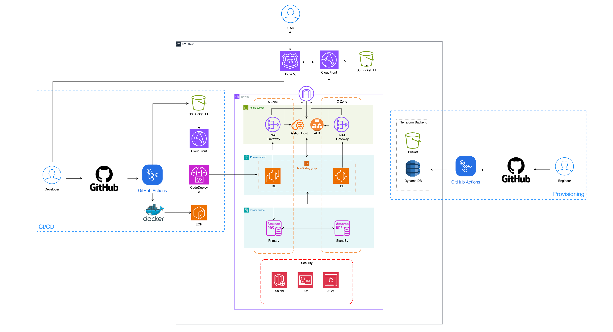

# AWS 3-Tier Architecture with Terraform (IaC) & GitHub Actions CI/CD

2025년 2월에 구축한 개인 프로젝트로, AWS 3-Tier 인프라와 배포 파이프라인을 Terraform 모듈과 GitHub Actions로 자동화했습니다.

## 프로젝트 목적

AWS 콘솔에서 리소스를 수동으로 생성할 때는 설정을 재현하기 어렵고, 변경 이력을 추적하기 힘들며, 제한된 예산 때문에 리소스를 반복해서 생성하고 삭제해야 했습니다. 이를 해결하기 위해 네트워크부터 애플리케이션 배포 기반까지 코드로 정의하고, CI/CD로 검증과 적용을 자동화했습니다.

- Terraform 모듈화와 변수화로 동일한 인프라를 반복 생성
- Git으로 인프라 변경 이력 추적
- GitHub Actions로 포맷·유효성 검사와 배포 자동화
- 외부 노출이 필요 없는 애플리케이션·DB 계층을 private subnet에 배치

## 아키텍처

두 개의 가용 영역에 public/private subnet을 구성하고, 정적 프론트엔드와 API 요청 경로를 분리했습니다.



> 2개 AZ와 선택 가능한 RDS Multi-AZ 구성을 포함한 설계 기준 아키텍처입니다. 개발 환경에서는 비용과 가용성 요구에 따라 `multi_az` 값을 선택합니다.

<details>
<summary>텍스트 구조 보기</summary>

```text
                                  ┌─────────────────────────────┐
                                  │ Route 53 + ACM (HTTPS/DNS)  │
                                  └──────────────┬──────────────┘
                                                 │
                         ┌───────────────────────┴───────────────────────┐
                         │                                               │
                         ▼                                               ▼
              ┌─────────────────────┐                         ┌─────────────────────┐
              │ CloudFront CDN      │                         │ ALB (HTTPS)         │
              │ + Origin Access     │                         │ public subnets      │
              │ Control (OAC)       │                         └──────────┬──────────┘
              └──────────┬──────────┘                                    │
                         │                                               ▼
                         ▼                                    ┌─────────────────────┐
              ┌─────────────────────┐                         │ EC2 Auto Scaling    │
              │ S3                  │                         │ Docker Spring Boot  │
              │ React static files  │                         │ private subnets     │
              └─────────────────────┘                         └──────────┬──────────┘
                                                                        │
                                                                        ▼
                                                             ┌─────────────────────┐
                                                             │ RDS MySQL           │
                                                             │ private subnets     │
                                                             └─────────────────────┘

              ┌─────────────────────┐              ┌──────────────────────────────┐
              │ Bastion Host        │              │ NAT Gateway per AZ           │
              │ controlled access   │              │ private subnet egress        │
              └─────────────────────┘              └──────────────────────────────┘
```

</details>

프론트엔드는 S3에 저장하고 CloudFront OAC를 통해서만 읽도록 제한합니다. 백엔드는 ALB 뒤의 EC2 Auto Scaling Group에서 Docker 기반 Spring Boot 애플리케이션으로 실행되며, RDS MySQL은 외부에서 직접 접근할 수 없습니다. Bastion Host는 운영 접근 경로를, AZ별 NAT Gateway는 private subnet의 외부 통신을 담당합니다.

## Terraform 모듈 구조

| 모듈 | 책임 |
| --- | --- |
| `vpc` | VPC, 2개 AZ의 public/private subnet, Internet Gateway, NAT Gateway, route table 구성 |
| `ec2` | Launch Template, Auto Scaling Group, 보안 그룹, CodeDeploy/ECR/S3 접근용 IAM instance profile 구성 |
| `alb` | HTTP→HTTPS 리다이렉트, HTTPS listener, target group, Auto Scaling 연결 구성 |
| `rds` | private DB subnet group과 MySQL RDS, 보안 그룹, Multi-AZ 옵션 구성 |
| `cloudfront` | S3 origin용 CloudFront 배포, OAC, HTTPS, bucket policy 구성 |
| `s3-static-site` | React 정적 파일용 S3 bucket, public access 차단, SPA index/error document 구성 |
| `bastion` | public subnet의 운영 접근용 Bastion EC2와 접근 보안 그룹 구성 |
| `acm` | ACM 인증서 발급과 Route 53 DNS 검증 레코드 구성 |
| `route53` | CloudFront, ALB API, RDS endpoint용 DNS record 구성 |
| `codedeploy` | CodeDeploy application/deployment group, IAM role, 배포 artifact용 S3 bucket 구성 |
| `backend` | Terraform remote state용 versioned/encrypted S3 bucket과 DynamoDB lock table 구성 |

환경별 조합은 `environments/dev/`, 원격 상태 저장소의 최초 생성은 `bootstrap/`에서 관리합니다.

## 원격 상태 관리

`bootstrap/`은 애플리케이션 인프라와 분리된 S3 bucket과 DynamoDB table을 먼저 생성합니다.

- S3 versioning과 AES-256 server-side encryption 적용
- public access 전면 차단
- DynamoDB의 `LockID`를 이용한 state lock으로 동시 적용 충돌 방지
- 실제 bucket/table 이름과 state 파일은 Git에 포함하지 않음

## CI/CD

### Terraform

- `terraform-ci`: `main` push와 pull request에서 `terraform fmt -check`와 `terraform validate` 실행
- `terraform-cd`: `main` push에서 `terraform apply -auto-approve` 실행
- 두 workflow 모두 Terraform `1.5.7` 사용
- AWS 자격증명은 GitHub Actions Secrets로 주입

### 애플리케이션 배포 연계

이 인프라의 배포 대상은 별도의 비공개 companion repository `g1ennk/sample-application`에서 관리합니다.

- Backend: Gradle build → Docker image 생성 → ECR push → CodeDeploy 인플레이스 배포
- Frontend: React build → S3 업로드 → CloudFront cache invalidation

애플리케이션 저장소에는 기존 private 히스토리가 포함되어 있어 공개 링크를 제공하지 않습니다.

## 정량 성과

| 지표 | 개선 전 | 개선 후 | 결과 |
| --- | ---: | ---: | ---: |
| 월 운영 비용 | $210 | $75 | 약 65% 절감 |
| 인프라 구축 시간 | 1시간 | 30분 이내 | 50% 단축 |
| 배포 소요 시간 | 10분 | 3분 | 70% 단축 |

Terraform 모듈화와 변수화로 전체 리소스를 단일 흐름에서 생성·삭제할 수 있게 했고, 필요할 때만 인프라를 운영해 상시 유지 리소스를 줄였습니다. 애플리케이션 빌드·전달·배포 과정을 GitHub Actions로 자동화해 반복 작업 시간을 단축했습니다.

## 주요 트러블슈팅과 선택 근거

### CloudFront 403 Access Denied — React SPA

CloudFront가 기본으로 반환할 파일을 찾지 못해 React SPA 진입 시 `403 Access Denied`가 발생했습니다. CloudFront의 Default Root Object를 `index.html`로 지정하고 S3 website의 error document도 `index.html`로 구성해, 정적 파일 제공 이후 React Router가 클라이언트 라우팅을 처리하도록 했습니다.

### CodeDeploy 배포 방식

추가 배포 리소스 비용을 피하면서 수동 배포의 중단 위험을 줄이기 위해 CodeDeploy 기반 인플레이스 배포와 실패 시 자동 rollback을 구성했습니다. 현재 Terraform deployment group은 `AllAtOnce`와 `WITHOUT_TRAFFIC_CONTROL`을 사용하므로 완전한 무중단 배포는 보장하지 않으며, Blue/Green 전환을 후속 개선 과제로 남겼습니다.

### RDS Multi-AZ

RDS module은 장애 조치가 필요한 환경에서 Multi-AZ를 활성화할 수 있도록 변수화했습니다. 비용을 우선하는 개발 환경에서는 비활성화할 수 있고, 고가용성이 필요한 환경에서는 `multi_az = true`로 선택할 수 있습니다.

## 한계와 후속 프로젝트

| 이 프로젝트의 한계 | 이후 확장 |
| --- | --- |
| EC2 Auto Scaling까지 구성했지만 컨테이너 오케스트레이션은 미적용 | **NE:MO**에서 Kubeadm 기반 Kubernetes, Calico, NGINX Ingress, Helm과 Argo CD GitOps 구축 |
| CodeDeploy 인플레이스 방식으로 완전한 Blue/Green 무중단 배포는 미적용 | 배포 전략의 다음 개선 과제로 Blue/Green 전환 검토 |
| 실시간 지표 수집과 장애 대응 체계가 부족 | **FlowMate**에서 Prometheus/Grafana 기반 모니터링 운영 경험으로 확장 |

## 사용법

### 1. 사전 준비

- Terraform 1.5.7
- AWS CLI 자격증명
- 사용할 Route 53 hosted zone과 ACM 인증서
- EC2 key pair

실제 자격증명, 비밀번호, 계정 ID, 도메인, state 및 `terraform.tfvars`는 커밋하지 마세요.

### 2. 원격 state backend 생성

```bash
cd bootstrap
cp terraform.tfvars.example terraform.tfvars
# terraform.tfvars에 고유한 S3 bucket과 DynamoDB table 이름 입력
terraform init
terraform plan
terraform apply
```

생성된 S3 bucket과 DynamoDB table 이름을 `environments/dev/main.tf`의 backend placeholder에 반영합니다.

### 3. 개발 환경 변수 준비

```bash
cd ../environments/dev
cp terraform.tfvars.example terraform.tfvars
# AMI, key pair, domain, certificate ARN, database 값 등을 환경에 맞게 입력
```

운영 환경에서는 DB 비밀번호를 tfvars에 평문으로 저장하지 말고 AWS Secrets Manager 등의 비밀 관리 서비스를 사용하세요.

### 4. 인프라 적용

```bash
terraform init
terraform fmt -check
terraform validate
terraform plan -var-file=terraform.tfvars
terraform apply -var-file=terraform.tfvars
```

리소스 비용과 변경 계획을 검토한 뒤 `apply`를 실행하세요.
